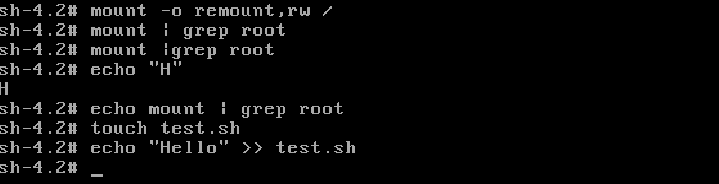

Попасть в систему без пароля несколькими способами
Способ 1. init=/bin/sh

В конце строки начинающейся с linux16 добавляем 
init=/bin/sh и нажимаем сtrl-x для загрузки в систему
В целом на этом все, Вы попали в систему.  
Рутовая файловая система при этом монтируется в режиме Read-Only. 
Если вы хотите перемонтировать ее в режим Read-Write можно воспользоваться командой:

[root@otuslinux ~]# mount -o remount,rw /

После чего можно убедиться записав данные в любой файл или прочитав вывод команды:

[root@otuslinux ~]# mount | grep root

​

Способ 2. rd.break
●В конце строки начинающейся с linux16 добавляем rd.break и нажимаем сtrl-x для загрузки в систему

●Попадаем в emergency mode. Наша корневая файловая система смонтирована (опять же в режиме Read-Only, но мы не в ней. Далее будет пример как попасть в нее и поменять пароль администратора:

[root@otuslinux ~]# mount -o remount,rw /sysroot

[root@otuslinux ~]# chroot /sysroot

[root@otuslinux ~]# passwd root

[root@otuslinux ~]# touch /.autorelabel

●После чего можно перезагружаться и заходить в систему с новым паролем. Полезно когда вы потеряли или вообще не имели пароль администратор.
